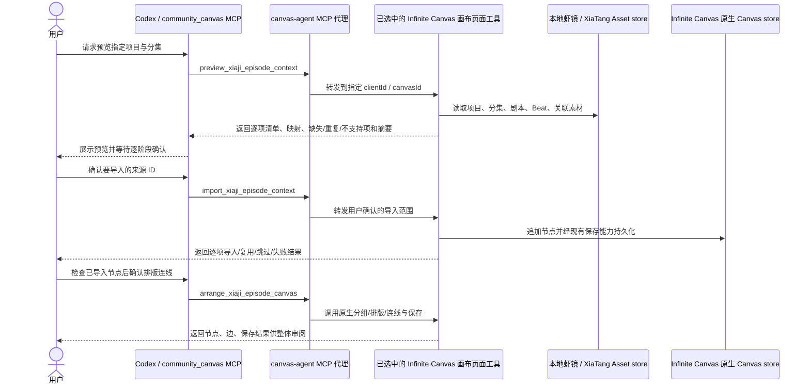

# 虾镜 Beat 上下文导入原生虾画：架构决策

> **历史记录，已被新方案取代。**本文件只记录上一版单集 Beat 导入设计和当时实现状态；当前权威方案见[统一项目架构](2026-09-27-xiaji-single-project-workflow.md)、[规格](../superpowers/specs/2026-09-27-xiaji-single-project-workflow.md)和[计划](../superpowers/plans/2026-09-27-xiaji-single-project-workflow.md)。不得按本文件单独开工。

状态：**用户已批准；2026-09-26 的 6sol 代码审阅发现的四项缺陷已修复并补回归测试。Web 271 项、Canvas Agent 25 项和 Go 全包测试通过；生产前端已重建并恢复服务，API health 200。标准 TypeScript 检查仍被 `.next/dev/types` 对已删除 `freezone/page.js` 的陈旧引用阻断；真实浏览器验收未完成。**这是当前虾镜到虾画连接方案的权威架构文档。实现范围只包括虾镜本地记录的只读预览、经用户确认后的导入，以及再次确认后的布局/连线；视频生成不在本方案内。

关联文档：[规格](../superpowers/specs/2026-09-25-xiaji-beat-context-canvas-import.md)、[实施计划](../superpowers/plans/2026-09-25-xiaji-beat-context-canvas-import.md)、[实施提示词](../superpowers/prompts/2026-09-25-xiaji-beat-context-canvas-import-execution-prompt.md)。

## 已确认的产品决定

- Infinite Canvas 是主应用；虾料、虾塘、虾镜是影视创作工作台；虾画继续使用 Infinite Canvas 原生画布。
- 剧本、制作拆解和素材准备由 Agent/Codex 配合用户完成。工作台展示阶段、输入、产物和待审阅项，不把确认后的步骤自动串成无人审阅的流水线。
- 用户确认的虾镜内容应全部可导入虾画；用户逐阶段检查导入内容。全部节点检查后，用户再确认统一排版、建立来源关系连线，最后整体审阅。
- 虾画/虾镜连接只读取 Infinite Canvas 本地素材和项目记录，不连接 DramaClaw，不新增服务端路由或数据库。
- 本方案不生成视频，也不调用图像、音频或视频生成任务。已有本地媒体可按实际 Canvas 节点能力导入；生成媒体的方式和服务另行决定。
- 不加入虾面、虾导、虾格、虾体或“回主线”。

## 当前实现证据与边界

以下是源码可见事实；它们说明现有能力基础，不代表端到端集成已完成。

| 位置 | 当前可见事实 | 对本方案的影响 |
|---|---|---|
| `web/src/features/xiaji/local-studio-model.ts` | 项目、分集、剧本和 Beat 都以本地 text Asset 表达；Beat 有项目 ID、分集 ID、顺序、正文 Asset 内容、可选对白和 `referencedAssetIds`。 | 导入器应按稳定 Asset ID 读取，不能按显示名称猜关系。当前没有独立 Beat 版本号，也没有完整的结构化镜头时长、说话人/声线与场景变体字段。 |
| `web/src/features/xiaji/local-studio-repository.ts` | `saveScript` 同步推进 episode `updatedAt` 并校验 canonical 回读含 `scriptAssetId`；目标行为有 RED/GREEN repository 单测。 | 本地关联持久化的单测前置已通过；浏览器刷新仍未验收。 |
| `web/src/features/xiaji/send-to-canvas.ts` | 本地 Asset 的 text/image/video/audio 可映射到原生节点；保留来源 Asset ID、分类、标签和 XiaTang metadata；`fileOnly` 记录被跳过，非文本媒体只检查引用非空；现有合并默认按来源 Asset ID 去重。 | 复用节点类型与媒体字段映射，但虾镜投影须新增按版本投影键的专用去重；不能沿用按来源 ID 去重来处理内容变更，也不能把引用非空当作可读取。 |
| `web/src/features/xiaji/local-assets-mcp.ts` | 现有 `import_local_assets` 限定 `SHOT-05` 至 `SHOT-08`，要求已有匹配镜头组，仅接受本地图片/音频，并生成 idle 配置草稿；不导入项目、分集或 Beat 记录。 | 它不能满足整集导入，不能通过放宽镜头键来冒充 Beat 上下文导入。 |
| `web/src/app/(user)/canvas/agent/canvas-agent-tools.ts`、`web/src/app/(user)/canvas/[id]/canvas-client-page.tsx` | 当前已登记虾镜只读预览、按批准来源 ID 导入、二次确认后排版连线；Canvas handler 校验摘要/节点清单，并在保存后从本地 canonical store 回读。 | 保存调用经过 store 的普通单画布保存路径；真实浏览器和刷新持久化尚未走通。 |
| `web/src/app/(user)/canvas/stores/use-canvas-store.ts`、`web/src/services/api/local-workspace.ts`、`service/local_workspace.go`、`repository/local_canvas_project.go` | store 将当前状态与最后一次 canonical 回读作差，仅同步变更画布并附 `expectedProjects`。客户端保存队列串行；服务端 `/sync` 和单项目保存路由在事务内核对旧 `created_at`、`updated_at`、规范化完整 `project_data`，使用旧值作 SQL 条件更新。软删除也提交完整预期快照并在事务内做条件更新，冲突批次回滚。 | 旧快照被拒绝，冲突批次回滚；客户端保留当前页候选、显示错误并停自动保存。Go handler HTTP 回归覆盖保存双写、批次回滚与过期删除拒绝。显式 ZIP 导入仍不在该 CAS 保证内。 |
| `canvas-agent/index.mjs`、`canvas-agent/mcp-session.mjs` | `community_canvas` 读取已连接页面登记的动态工具定义，并把工具调用代理到被选中的页面连接。 | 新工具需要由 Infinite Canvas 页面登记并处理；MCP 代理层负责工具发现、目标连接与转发，不承载虾镜业务数据。 |

与此功能直接相关的现有 MCP/页面动作包括：`list_local_assets`（`page`、`pageSize`、`keyword`、`type`、`category`、`tag`；返回摘要，不返回媒体内容或路径）；`import_local_assets`（1–4 个 `shotGroups`，每组需 `shotKey`、已有 `groupNodeId`、1–50 个 `assetId`/`role`；镜头键固定 `SHOT-05`–`SHOT-08`，只接受图片/音频）；页面动态动作 `create_text_node(title, content, sourceNodeIds?)`、`create_connection(fromNodeId, toNodeId)`、`create_group(title?, nodeIds)`（至少两个节点）与 `arrange_nodes(nodeIds?)`（最多 50 个节点；省略时整理顶层节点）。这些原语没有项目/分集/Beat 校验，且普通节点工具分别调用不会自动具备整集导入语义。`community_canvas` 本身负责把已连接页面的工具调用转发到选定 `clientId`，不直接读取页面之外的虾镜数据。

## 系统边界与调用链

无 DramaClaw host/API、数据库、项目服务、生成任务或源端写回参与。工具必须锁定当前选中的画布连接；当同一画布有多个页面连接或目标不明确时，拒绝写入并要求明确选择。

## 来源数据与节点映射

### 当前可导入的数据

- 项目与分集身份、分集标题/简介、已保存剧本正文。
- 每个 Beat 的稳定 Asset ID、顺序、标题、正文、可选对白、现有本地 Studio metadata。
- Beat `referencedAssetIds` 指向且通过项目归属校验的虾塘记录；对关联媒体仅解析当前明确选中的 `mediaCurrentBySlot` 版本，保留媒体 Asset ID、父子关系和槽位，不把所有历史版本自动扩入闭包。
- 现有映射支持 text/image/video/audio，但任何 `fileOnly` 媒体记录都会跳过；非文本媒体引用非空只是候选资格，预览标为“有引用、可读性未验证”。能用现有本地读取路径验证时才标“已验证可读”；实际导入失败仍逐项报告。

### 当前不能推定的数据

- 不从对白文本猜说话人或声线；不从场景描述猜场景/变体 ID；不从共享角色引用推断镜头连续性。
- 不伪造当前尚未结构化保存的镜头时长、时间/环境、动作段、制作状态、生成版本或时间线位置。
- 当前 schema 未提供原生版本序号。预览可计算映射内容摘要用于检查“预览后源数据是否变化”和幂等，不得把摘要称作用户可管理的素材版本历史。
- 当剧本引用字段缺失，或分集内存在重复/无效 Beat 顺序，预览必须显示阻断项；不得隐藏问题并生成不完整“成功”结果。

### 原生画布投影

1. 每份经确认的剧本正文建立一个文本节点；每个获批 Beat 建立一个文本节点，正文与实际保存字段保持一致。剧本节点是投影锚点。
2. 获批的 XiaTang Asset 使用已有节点类型/媒体字段映射；同一来源在**同一投影版本**内只有一个节点，可被多个 Beat 引用。其他投影、旧 `send-to-canvas` 节点即使来源 ID 相同，也不能被本投影“认领”或修改。
3. 每个本投影节点（包括后建分组）的 Canvas `node.metadata` 保存 `projectionId`、`projectionKey`、`sourceDigest`、单项 `sourceItemDigest`、来源 Asset/项目/分集/Beat ID、顺序与适用的领域字段。实施时给 `CanvasNodeMetadata` 增加这些可选字段；剧本锚点还保存获批来源 ID 清单、`mode` 和投影清单摘要，供刷新重建索引。不能只把关系放进标题或正文。
4. 导入阶段只追加或复用**相同 `projectionKey` 且内容摘要一致**的节点；不修改其他节点/边，也不自动创作媒体。若同键内容不同、node ID 冲突或用户已编辑投影节点，返回冲突，绝不覆盖。
5. 用户确认“整理画布”后，只对该投影创建分组和确定性布局；剧本 → 按 `order`、再按 Beat Asset ID 规范排序的首个 Beat → 后续 Beat，及 Beat → 已导入且被其显式引用的素材建立边。局部模式不跨缺失 Beat 连边；缺少任一边端点时逐边阻断并报缺项，不推断戏剧关系。
6. 边 ID 从 `[projectionId, edgeKind, fromProjectionKey, toProjectionKey]` 规范编码/摘要生成；仅操作本投影两个端点且 ID 可验证的边。已有同端点的用户边视为关系已满足但**不认领、不改动**；ID 碰撞或端点被改动时报冲突。

### 导入集合、投影身份与来源变更

- 预览给出 `requiredSourceAssetIds`（已关联的唯一剧本 Asset、该集全部有效 Beat）和 `referencedSourceAssetIds`（这些 Beat 显式引用的虾塘 Asset，去重）；其当前选中且有原生映射的媒体版本列为 `selectedMediaAssetIds`。媒体的 `parentId`/`slot`/`versionOf` 与父记录的 `mediaCurrentBySlot` 必须对得上。缺失、跨项目、歧义引用均为阻断；无映射、`fileOnly`、不可读项逐项列出。
- `mode=complete` 要求 `sourceAssetIds` 精确等于上述三个集合的可导入闭包；任何必需项、显式引用或当前选中媒体不可导入时，不允许声称“整集完成”，而是阻断并提示修复。`mode=selected` 至少要求剧本和一个获批 Beat；其他 Beat/引用/媒体可经用户明确排除，响应列出 `excludedSourceAssetIds` 和缺少的关系，状态始终是 `partial`。被导入 Beat 的跨项目/缺失引用不能靠排除绕过归属校验。
- `sourceDigest` 是 SHA-256(规范 JSON)，覆盖项目身份与类型/风格、分集身份与顺序/标题/简介/`scriptAssetId`、剧本 ID/标题/正文/`documentKind`、全部 Beat 的 ID/顺序/标题/正文/对白/显式引用/领域 metadata、所有引用虾塘记录的 ID/类型/标题/分类/标签/领域 metadata、当前媒体槽位与选中版本 ID、媒体类型和实际引用值；对象键排序、集合按稳定 ID 排序，不含易变 `updatedAt`。不返回媒体 URL/路径给预览调用方。单项摘要按该项实际投影字段计算；来源改动会导致新摘要，不冒充上游版本号。
- `projectionId = "xiaji:" + SHA-256(规范 JSON [canvasId, projectAssetId, episodeAssetId, sourceDigest, mode, 排序后的 sourceAssetIds])`；`projectionKey = "xiaji:v1:" + SHA-256(规范 JSON [projectionId, role, sourceAssetId])`，节点 ID 从投影键稳定派生。相同输入与已保存键复用，来源改动后新摘要产生新投影 ID 和新节点，不覆盖旧投影。导入参数 `changedSourcePolicy` 只能是 `create-new` 或 `reject`；预览指出旧投影时用户选择，默认 `reject`。现有按 Asset ID 去重的 helper 必须为本命名空间调整或旁路，保留旧入口行为。
- 刷新后仅从**当前 Canvas 的已保存节点**重建投影索引：查找唯一 `projectionRole=script` 且 `projectionId`/`canvasId`/项目分集/清单摘要均匹配的锚点；再逐个核对同 `projectionId` 节点的投影键、来源 ID、单项摘要、节点 ID 与获批闭包。锚点缺失、重复、清单不齐或内容被改动时返回 `projection-incomplete`/`projection-conflict`，不凭调用参数伪造投影成功；排版不得触碰无归属节点。

## 建议的 MCP 工具契约

这些语义工具已由当前画布页面动态注册；运行时发现/转发通过 MCP 代理集成测试。浏览器端到端仍未验证。

### `preview_xiaji_episode_context`（只读）

输入：`projectAssetId`、`episodeAssetId`。

返回：本地项目/分集身份，剧本及按序 Beat 清单、`requiredSourceAssetIds`/`referencedSourceAssetIds`/`selectedMediaAssetIds`、关联素材资格及可读性、节点/边草案、缺失/不支持/冲突项和 `sourceDigest`。标明 `complete` 能否进入导入确认；不写素材、不创建画布节点、不保存、不调用生成。

### `import_xiaji_episode_context`（写入 Canvas，需绑定已审阅预览）

输入：`projectAssetId`、`episodeAssetId`、预览返回的 `sourceDigest`、`mode=complete|selected`、明确批准的 `sourceAssetIds`、`changedSourcePolicy=create-new|reject`、`idempotencyKey`。同一幂等键绑定同一 Canvas、参数和投影 ID；换参重用该键返回 `idempotency-conflict`。

执行前重新读取并验证项目/分集归属、Beat 顺序、闭包与 `sourceDigest`。源数据已变化返回 `stale-preview`。成功时仅追加/复用获批且本投影所属节点，暂不创建最终连线。返回 `projectionId`、`mode`、`complete|partial|unconfirmed`、获批/排除 ID、每项 source ID → node ID 及 `created/reused/skipped/failed`、保存回读证据与可重试项；保存未确认不得返回 `complete`。

### `arrange_xiaji_episode_canvas`（用户审阅节点后的第二个写入阶段）

输入：`projectionId`、锚点 `manifestDigest`、二次审阅批准的完整 `approvedNodeIds` 和新的 `idempotencyKey`。从已保存画布重建投影索引，验证锚点、全部预期节点、来源归属及内容基线；只更新未被用户改动的本投影节点的位置/分组并补齐两端均属于本投影的确定性关系边。`selected` 模式不得被标作整集排版；逐项报告缺边、外部已有边、冲突及保存回读结果。

三项工具通过页面动态 schema 暴露给 `community_canvas`。若实现发现页面无法访问同一 canonical Asset store，应停止并先修订边界，不得退化为新建来源服务/API。

## 失败恢复和一致性

- **归属校验：** 所有输入 ID 都从当前已加载的 canonical Asset 集合解析，并验证 project → episode → script/beat → XiaTang 引用闭合。仅名称相同不算关系。
- **源变更：** `sourceDigest` 不匹配时不导入，要求重新预览和确认。
- **部分失败：** 按来源项和写入阶段返回可观测结果；保存未确认时整体为 `unconfirmed`，不发成功提示。重试同键先回读当前 canonical Canvas、按投影键核对并只补缺项；同键异参拒绝。
- **保存与并发门禁：** 普通画布编辑与投影保存使用变更集及 `expectedProjects`；客户端队列避免同一页面请求乱序，服务端 CAS 是跨标签旧快照拒绝的最终边界。软删除携带项目的预期快照并条件更新；冲突不删除，成功后客户端回读 canonical 列表。保存冲突时页面保留内存候选并展示错误、停自动重试；候选尚未落盘，刷新会丢失。HTTP handler 测试覆盖同基线保存冲突、批次事务回滚和过期删除拒绝；真实双标签浏览器验证仍待执行。显式 ZIP 导入不在本 CAS 承诺范围内，也不用于虾镜投影保存。
- **保存失败与恢复：** 异常后重新读取 canonical Canvas 并核对每个目标键、节点、边及非投影基线。内存可能已经更新；不在未知状态下自动删除或宣称已回滚。返回 `failed|unconfirmed`、已确认/未确认 ID 与冲突；只对经回读证明可安全补齐的缺项幂等重试。若确认被其他写入覆盖，停止并要求人工处理。
- **媒体问题：** 不上传、不复制或生成媒体；只复用现有本地引用。`fileOnly` 总是不可映射；有引用但读取未验证只能在预览作候选，导入时读取/保存失败必须带 Asset ID、原因和阶段返回。

## 风险、门禁与未决项

| 项目 | 当前判断/门禁 |
|---|---|
| MCP 注册与画布目标 | 页面动态工具能否在断线、重复页面和工具 schema 更新时保持目标锁定，需通过会话集成测试。 |
| 剧本刷新回读 | 2026-09-25 E2E 记录了保存后刷新为空；先修复 `saveScript` 的 episode 关联与独立刷新回读，再开展整集导入验收。未修复时 `complete` 模式阻断，不能从临时 UI 状态导入或算通过。 |
| Beat/声音语义 | 当前没有明确说话人/声线/时长字段；先按现存字段忠实导入。若要添加结构化字段，另开数据契约决策，不在导入器中推测。 |
| 文件许可 | 本方案复用 Infinite Canvas 自有代码，不扩大 DramaClaw 源代码的复制范围；任何后续来源代码复用仍须按既有逐文件许可审查。 |
| 用户审阅 | 只读预览后必须把完整分项结果呈给用户；未收到导入确认不得调用写工具。节点导入后先停下供逐项检查；未收到排版确认不得生成最终布局/边。 |
| 确认可执行性 | Canvas Assistant 已在导入和排版两个写阶段前显示审阅卡并等待用户点击；这约束该 Assistant 路径，不约束任意直接调用动态页面工具的客户端。浏览器验证待完成。 |
| 视频 | 完全不实现视频生成、不启动生成任务、不更改视频服务。已有视频素材能否映射只取决于本地 Canvas 已有媒体映射，不构成生成支持。 |

## 后续执行结果（2026-09-26）

正式生产启动脚本已成功构建并启动项目服务；Next 编译约 20.5 秒并生成 24 个页面，构建跳过 TypeScript 验证。`/api/health`、`/api/local/canvas/projects`（只读）和 `/xiaji/projects` HTTP 检查为 200。全量前端、Go 和 MCP 测试复跑结果见实施计划；完整 `tsc` 仍被旧 `.next/dev/types` 引用阻断。

自动执行审核拦截了只清理 `.next/dev/types` 的计划命令，因此没有运行 `next typegen`，也没有尝试替代删除方式。CUA 仍发现不到浏览器；只读 MCP 显示 Agent 暂无连接和动态页面工具。真实 UI 导入、刷新、双标签交互、Network 与截图尚未验证；本机服务继续运行以待浏览器控制恢复。

## 验证范围

截至 2026-09-26 已运行：全量 `bun test` 57 files / 266 pass / 0 fail / 998 assertions；`go test ./... -count=1` 全部包通过，其中 handler HTTP 测试覆盖同基线保存冲突、批次回滚和过期删除拒绝；`community_canvas` 会话/代理集成 15/15。独立 source TypeScript 检查覆盖 327 个文件，0 诊断；标准 `tsc` 仍被 `.next/dev/types/validator.ts` 指向不存在 `freezone/page.js` 的旧生成类型错误阻断。仓库 Next CLI 提供 `typegen`；审阅确认只生成新路由类型不会自动移除另一目录中的旧开发态 validator，建议确认无开发服务后只清 `.next/dev/types`，再运行本地 `next typegen` 和本地 `tsc`。生产 `bun run build` 成功，Next compile 52 秒并生成 24 个静态页面；构建期因 `ignoreBuildErrors: true` 跳过类型验证，静态页面生成时因未启动 API 打印连接失败日志，构建退出码仍为 0。最近一次 CUA `getState` 返回空 apps/browsers 并报 `nodeRepl.fetch request failed`；此前检查 3000–3210 无监听，服务启动命令曾被审核拦截。故真实浏览器 E2E、smoke、Network 与截图尚无结果；服务启动与 CUA 是两个独立环境门禁，不能用单测/build 替代。

历史环境记录：生产 standalone 启动曾遇 Windows `EPERM`（pnpm React symlink）；直接 `next start` 命令曾被自动执行审查拒绝；当时 CUA 无可复用标签，本地 Agent `127.0.0.1:3210` 拒绝连接。后续应使用仓库生产启动脚本，但先核实它对既有进程的检查/替换行为；启动审核若仍拒绝，不得改用其他进程启动方式绕过。CUA 恢复后再做真实页面与 Network 验收。6sol（`gpt-6-sol ultra`）独立只读审阅确认：类型缓存、服务启动、浏览器发现需作为独立门禁；现有工作区没有格式化前快照，不能安全整文件回退画布页。该轮未运行代码、测试或服务，也未修改工作区。
