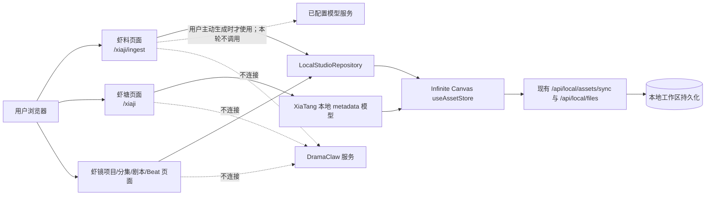

# 虾料、虾塘、虾镜本地验收架构

本文件是 [DramaClaw 创作模块本地移植架构](2026-09-24-dramaclaw-local-creative-suite.md) 的历史验收切片记录。它约束当时的真实浏览器验证；2026-09-25 用户已进一步决定从当前产品移除虾面页面、路由和入口。

本文不定义当前虾镜→虾画整集导入架构；该功能的当前设计见[Beat 上下文导入架构](2026-09-25-xiaji-beat-context-canvas-import.md)。本文中“画布不属于本轮验收”仍只适用于该历史 E2E 轮次。

## 本轮系统边界

## 状态与职责

| 边界 | 现有职责 | 本轮要核实的契约 |
|---|---|---|
| 页面路由 | `/xiaji/ingest` 新建项目；`/xiaji` 虾塘四类资产；`/xiaji/projects` 本地项目选择；`/xiaji/project/{projectId}/episodes/...` 虾镜流程 | 页面可达、链接目标正确；缺少项目时状态明确，不丢弃用户未保存输入 |
| `LocalStudioRepository` | project/source/episode/script/beat 记录的校验、父子关系、读写 | project 指向 source asset；episode 指向 project；beat/script 指向 episode；保存以后读取 canonical asset，而不是只显示乐观状态 |
| `XiaTangLocalModel` | 角色、场景、道具、声线槽位及媒体关系写入 `metadata.xiaTang` | 本轮 CRUD 必须经 `/xiaji/project/{projectAssetId}/characters` 保持项目作用域；`domain`、`recordType`、`parentId`、`projectAssetId`、slot 和媒体关联在新建/编辑/刷新后仍一致。全局 `/xiaji` 只做无写入 smoke |
| `useAssetStore` 与本地 workspace API | 本地素材 canonical 列表、Asset 同步与文件上传/保存 | 保存失败时展示错误；未提交失败记录为成功；测试清理只作用于本轮创建的准确 ID |
| 模型调用 adapter | 使用用户在 Infinite Canvas 配置的生成模型 | E2E 不调用模型；缺少配置时只验证提示/禁用状态，不打开外部任务 |
| 画布 | Infinite Canvas 原生 Canvas | **不属于本轮验收**；虾面/Freezone 页面已按后续决定从当前产品范围移除 |

## 数据流不变量

1. 虾料输入先形成页面草稿，用户确认后通过 repository 保存 project、source 和初始 episodes；必须检查服务端返回的 canonical records。
2. 虾塘领域记录使用既有 Asset store，具体领域字段留在 metadata，媒体为关联的本地文件/Asset；角色、身份、场景变体、道具和声线槽位不能被测试脚本压成同一种记录。
3. 虾镜的 episode、script 和 beat 由稳定的 Asset ID 关联；E2E 刷新后按页面读取，不通过直接改数据库或注入 store 伪造成功。
4. 本地模型/任务能力缺失时，UI 展示缺口并阻止该操作；验收脚本不以 mock 网络响应或伪造进度代替真实路径。
5. DramaClaw 不是数据源、运行时依赖或测试服务；其源码/截图只作来源控件比对依据。

## 风险与恢复

- 测试保存会改动用户本地 workspace；必须用唯一 `E2E-临时-<runId>` 前缀及精确 asset IDs。
- 用户已授权本轮创建和清理 `E2E-临时` 临时项目及其子记录；授权不包括其他项目或全局无归属素材。保存后必须从 canonical list 回读，清理前用依赖引用检查确认目标集合。
- 资产删除接口是永久删除，不是回收站。清理前需用户明确授权，并只删本次 run 建立的根记录及其测试子项；不做全库清理。
- 端到端失败若发生在文件上传后、Asset 同步前，先核对是否留有孤立文件；没有证据时不自动批量删除。
- 当前 CUA 暴露页面与控制台，不直接暴露 DevTools Network 请求表。本轮只能把 Performance Resource Timing / 可见浏览器日志作为有限运行时证据，并清楚标记；不能声称完成 Network 面板验收。
- 本轮已获准对 `E2E-临时` 项目及可证明归属的子记录进行创建和清理；该授权不延伸到现有项目、全局素材、画布或未关联的媒体文件。最新续跑已在 3000 完成写入 E2E，chunk 404 未复现；媒体文件操作仍未执行。

## 历史 Next.js chunk 404 与最新复核

首轮浏览器运行曾观察到两个 Next chunk 返回 404 并触发 `ChunkLoadError`。最新续跑在同一 `http://localhost:3000` 访问项目内虾塘和虾镜动态页面时，chunk 返回 200，HTTP 响应 SHA-256 与 checkout 中普通及 standalone 构建文件一致；没有再次观察到该错误。运行进程 PID 与首轮记录不同，但更替原因、运行进程 CWD 和具体 build root 未核实。因此只可得出“当前续跑可交互、历史问题未复现”，不能宣称根因已修复。

本轮没有运行 build、停止或重启服务。当前无需为已经可访问的 E2E 再执行环境恢复。若 chunk 404 复现，再只读取证 3000 listener、工作目录、build ID/manifests、静态目录和启动日志；在证据明确后再形成可能覆盖 `.next` 或影响进程的变更方案。既有配置事实仍适用：

- `web/next.config.ts` 使用 `output: "standalone"`。
- `run-infinite-canvas-frontend.ps1 -Production` 从 `web/` 调用 `next start`。
- `docs/backend/local-development.md` 记载选择 `next start` 是为规避 Windows standalone/pnpm 链接 `EPERM`。
- `launch-infinite-canvas.ps1` 的生产流程可能在判定并替换旧 3000 服务之前触发 build；其 ready 检查只验证 HTML 与 API bridge，不检查客户端 chunk。若以后需恢复，不把该启动器的 ready 状态当作 chunk 验收。
- 当前观察到的 3000 命令行为 `next start --hostname 127.0.0.1 --port 3000`，build ID 为 `vbs0ChmA1whAYWMg0dFqq`；运行进程的工作目录没有直接读取。

不能默认改用其他端口替代 3000：之前在 3101 的独立 origin 被重定向到登录页，origin-specific session/storage 不同。最新验收使用原 3000 origin；本轮只将实际 chunk 200 和可交互页面作为页面加载证据，不推断历史故障根因。

## 已观察 UI 缺陷

项目内虾塘新增角色、场景、道具时，弹窗标题显示“编辑…资料”。代码位置为 `web/src/features/xiaji/xia-tang-local-page.tsx` 的 `XiaTangFieldEditor` 标题；当前标题依据 `recordType` 决定编辑文案，没有区分创建状态。它是新增/编辑状态呈现错误，需在后续修正并由真实页面回归；与 Asset 保存是否成功分开记录。

## 本轮验收边界

- 虾镜的可测本地链路止于分集、手写剧本、Beat 草稿与合成页状态；不把指向虾面或禁用的视频/音频/图像生成控件算作通过。
- 运行时 Network 面板无法由当前 CUA 读取；Performance Resource Timing 的有限结果不能替代 Network 检查，也不得据此宣称无 DramaClaw 请求。
- 页面路由的 HTML 返回 200 不等于 Next 客户端 chunk 完整。最新续跑已观察到 chunk 200、页面可交互并完成数据 E2E；未来运行仍须核对真实页面状态，不能只看 HTML。
