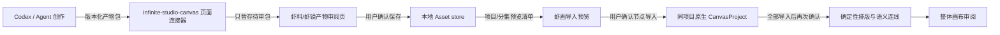

# 虾料、虾塘、虾镜与原生虾画统一项目架构

状态：**实施中；用户已于 2026-09-28 授权执行。** 6sol 已完成一次只读架构复核；本版吸收其 P0/P1/P2 意见。实现和验证状态持续记录于配套计划与进度文档。

## 结论

采用一个本地影视项目根记录作为唯一项目身份。虾料负责建立项目和保存原稿；虾塘、虾镜都在这个项目上下文下读取和维护素材、分集与制作内容；Infinite Canvas 原生虾画通过持久关系绑定到同一个项目。项目页提供“打开虾画 / 创建虾画”和分阶段导入入口。虾料、虾塘、虾镜负责承载、检查、确认与保存；剧本、分集、镜头和媒体内容由 Codex/Agent 执行并以可审阅产物交付。

页面不请求用户配置的文本模型，不启动剧本、镜头、图像、音频或视频生成，不伪造任务进度。MCP 只负责把 Agent 产物送到项目/画布页面、读取上下文、预览与执行用户已批准的导入；工具名出现在目录中不代表用户已批准写入。视频生成不在本轮实施范围。

## 当前实现证据与差距（2026-09-28）

| 当前状态 | 证据 | 尚需验证/影响 |
|---|---|---|
| `/xiaji/projects` 使用本地 `LocalStudioProjectsPage`，项目 ID 是本地 Asset ID。 | `web/src/app/(user)/xiaji/projects/page.tsx`；`web/src/features/xiaji/local-studio-pages.tsx` | 已作为唯一项目根；需浏览器走通项目到画布入口。 |
| 虾料与虾镜页面不再调用配置文本模型；本地标题解析可不生成分集。 | `local-studio-pages.tsx`、`local-studio-intake-model.ts`；本轮源码检索未发现 `requestCanvasAgentTurn` 出现在虾料工作台路径；相关定向测试通过。 | 静态检索不是 Network 证明；仍需浏览器检查页面请求。 |
| 项目/原稿/分集可在无剧本时保存；提交固定 ID、`commitId`、digest、payload 和关系，canonical 读取可确认成功、同尝试重试或维持未知。 | `web/src/features/xiaji/local-studio-repository.ts` 及 repository tests；本轮项目恢复用例通过。 | 浏览器保存、刷新和响应丢失恢复尚未 E2E 验证。 |
| 一个项目与一个画布通过 `xiajiProjectAssetId` 关联；本地写入在数据库事务中检查重复绑定，并用进程内互斥保护同一后端实例内并发。 | `repository/local_canvas_project.go`、`repository/local_workspace_references.go`、`service/local_workspace.go`；并发 repository test 通过。 | 当前单机拓扑只有一个后端进程。该保证不等价于跨多后端实例的数据库唯一索引；未来多副本部署需另加持久唯一约束。 |
| Agent package 校验、同标签 session handoff、待审 UI、显式确认写本地 Asset 已实现；脚本和 Beat 的修改保留历史版本。 | `xiaji-artifact-package.ts`、`local-studio-pages.tsx`、`local-studio-repository.ts` 与对应定向测试。 | 页面刷新/切换、断开后继续审阅需真实浏览器验证。 |
| 项目结构投影支持无剧本/Beat 导入；单集投影先导入节点，另一步经审阅后布局和建边，不覆盖既有内容。 | `project-canvas-projection.ts`、`episode-canvas-projection*.ts`、Canvas dynamic action dispatch 与对应 tests。 | MCP live 工具发现、节点 canonical 保存/刷新和真实整体布局验收未完成。 |
| 原受限 `import_local_assets` 已从静态工具、页面 action 和 dispatcher 撤下；页面代码另有通用 `import_assets_to_canvas` action，但其 MCP 动态暴露与保存回读尚未验收。 | `canvas-agent/static-tools.json`；Canvas Agent action registry 与页面 dispatcher | 后续只按通用素材 ID 设计/验收，不恢复固定 SHOT-05–08 工具。 |
| 定向验证已通过：`web/src/features/xiaji` 42 个文件 218 tests/907 assertions、Canvas Agent 16 tests、Go `repository/service/handler` 包、标准 TypeScript、Next 生产构建和 HTTP route/health smoke。 | 2026-09-28 实际命令结果；配套计划记录完整命令。 | 只读 `community_canvas.list_connected_canvases` 返回零连接/零动态工具；登录后用户流程 E2E、MCP live 动态导入、浏览器 Network 和来源/目标截图对照尚未完成。 |

## 唯一项目身份

- `projectAssetId` 是本地影视项目的根 ID，由现有本地 Asset store 持有；名称不是主键。
- 原稿、分集、剧本、Beat、虾塘角色/身份、场景/变体、道具、声线与媒体均用明确 ID 关联到项目或其父记录。
- `CanvasProject.id` 仍是原生画布自己的 ID；`CanvasProject.xiajiProjectAssetId` 保存关联的唯一项目根 ID。只按该 ID 查询，不按标题、最近创建时间或当前页面猜测。
- 产品规则是每个虾料项目至多关联一个虾画。当前 canonical 写入路径在同一 Go 后端进程中以互斥锁串行化绑定检查，并在数据库事务内校验该用户全部有效画布；并发测试证明同进程竞争最多一个写入成功，冲突响应带既有 Canvas ID。它依赖当前单一本地后端进程，不是跨进程数据库唯一约束。
- 若部署形态扩展为多个并发后端进程，需增加数据库级唯一约束或等价跨进程原子机制；当前交付不宣称支持多实例竞态。
- 创建/关联后从 canonical store 双向回读项目 ID 与 CanvasProject ID。写入响应不确定时先回读同一项目绑定；已有唯一绑定就复用，读不出时显示结果待确认并阻止盲目再建。Canvas JSON 持久化关系字段和同进程并发冲突均由定向/Go 测试覆盖。
- 项目入口统一列出虾料、虾塘、虾镜阶段和对应虾画。虾镜只能选择现有 `projectAssetId` 下的分集，不创建另一个脱节项目。

## 数据与 Agent 产物

Codex/Agent 交付版本化 `XiajiArtifactPackage`；当前代码已有 schema 校验、同标签待审 handoff 和确认保存路径，前端负责预览、用户确认和本地保存。相关测试覆盖无副作用暂存、损坏包拒绝、容量失败和恢复。包至少包含：

```text
schemaVersion, packageId, projectAssetId, episodeAssetId?, stage,
baseRevision, artifacts[], relations[], mediaAssetIds[], contentDigest
```

- `projectAssetId` / `episodeAssetId` 标识目标实体；`packageId` 标识不可变 Agent 包；`contentDigest` 校验包正文；`baseRevision` 是 Agent 读取时项目、分集、当前版本指针及所引用资产的 canonical 快照摘要，写入前必须重新计算并比较。
- Agent 使用包内稳定 `sourceKey` 互相关联。本地确认保存前由调用方预分配并固定所有 Asset ID；`commitId` 标识一次 Asset 保存尝试，`metadata.localStudioCommit.commitId`、ID、payload、关系和时间戳写入同标签尝试记录并在重试中原样复用。不能写入或恢复尝试记录时，不发送网络保存请求。成功后返回 `sourceKey → localAssetId` 映射。
- `projectionId` 标识一次确切的画布导入映射；`manifestDigest` 校验用户批准的节点 ID、来源版本、位置和边清单。相同 `projectionId` 与摘要是导入幂等身份；摘要变化必须重新预览确认。不再额外叠加语义重复的通用 `idempotencyKey`。
- 包只携带文本/结构化 JSON 及已存在的本地媒体 Asset ID；不接受远端 URL、内嵌二进制、生成任务 ID 或任意本机路径作为媒体来源。
- 重复 `packageId + contentDigest` 返回既有映射；同一 packageId 内容不同视为冲突，不覆盖。相同保存尝试的重试必须使用原 `commitId`、固定 IDs 和完全相同 payload；未知结果未解决前不得生成新 IDs 再建一份。
- 新版本采用追加记录并保留 `supersedesAssetId`/版本号；当前版本指针只能在用户确认且 canonical 回读通过后更新。若现有 Asset 元数据不足以可靠表达此关系，先在规格评审时展示最小 schema，再实现，禁止静默覆盖旧稿或旧 Beat。

## 页面、MCP 与画布的边界

完整复用意味着保留来源页面的层级、区域、字段、选项、按钮位置和审核节奏。会发起模型生成的源控件不能整块删空：改为“接收/导入 Agent 产物”“逐项审阅版本”“确认保存”等本地审核动作；模型配置入口改为明确说明“由 Codex/Agent 执行，不在此页调用模型”。视觉矩阵须逐项记录源控件、适配后的本地动作和未实现原因，避免“禁止生成”变成缺失整个创作步骤。



1. **MCP 暂存**：当前动态页面动作可把 Agent package 校验后写入同标签 sessionStorage；不写本地素材或画布。虾镜审阅页可通过待审摘要检查包，用户确认时重新验证项目、画布、版本并写本地 Asset。页面导航/刷新与容量故障恢复的自动化代码路径已有实现和定向测试；真实浏览器恢复尚未验证。MCP 暂存响应不确定时不得声称写入成功。
2. **保存到项目**：用户在虾料/虾镜页面检查每项字段后确认。应用写本地 Asset，回读后才显示“已保存”；失败时显示每个 Asset 的 `saved / missing / mismatch / unknown` 状态。
3. **项目结构导入**：允许只有项目、原稿和已确认分集时预览并导入；不得要求先创建剧本或 Beat。导入清单展示将新增/复用的节点、媒体、关系、重复项和阻断项。
4. **单集制作导入**：剧本、制作拆解/Beat、明确引用的虾塘资产和已存在媒体可以按阶段预览。缺少 Beat 或媒体时如实标为缺项；不伪造完整度。每个画布节点保存 `projectAssetId`、来源 `sourceAssetId`、`sourceType`、版本摘要和 `projectionId`，可选保存 `episodeAssetId` 与 package ID；源应用 ID 只作为来源元数据，不冒充本地项目/素材 ID。
5. **最终排版和连线**：所有获批节点先进入画布并保存、回读、供用户检查。随后单独预览 `manifestDigest` 覆盖的布局和关系边；仅依据包内或本地记录的明确关系建立 `项目 → 原稿/分集 → 剧本 → Beat → 引用资产/媒体` 连线。没有剧本时允许 `项目 → 原稿/分集` 结构；没有明确关系就不造边。用户再次确认后提交，不覆盖已有节点与边，不按标题/空间距离推测关系。

## 保存错误与恢复

- 将错误分为输入验证拒绝、请求明确失败、回读缺 ID、payload 不一致、关系不符、超时结果未知、画布绑定冲突、投影部分成功。数据库现有批量 Asset 写入在单个事务内完成；初始项目/原稿/分集创建应按原子批次验证，不能把一个 ID 未出现在响应里直接描述成已发生部分提交。投影分多次确认时才逐项跟踪部分成功。
- 写入请求发出前，客户端固定生成全部项目/原稿/分集 Asset IDs、`commitId`（记录于新建 Asset metadata）、payload、父子关系和摘要，并保存同标签恢复用的尝试记录。请求层保留 timeout/abort；超时后独立读取 canonical 数据并逐项比较 ID、关系与 payload。全匹配即确认已保存；未找到不证明原请求未提交；读取失败、原请求仍可能执行或状态互相矛盾时保持 `unknown-after-timeout`，显示“保存结果待确认”，不提示失败、不生成新 ID、不自动重复创建。
- 明确请求失败或用户选择重试时，必须沿用原 `commitId`、固定 IDs、payload 与时间戳。先按 ID/commitId 做 canonical probe；若现有同步接口无法保证相同尝试并发重试幂等，保持未知并先补齐最小契约，不以“探测暂时未找到”证明原请求没有提交。
- 保存成功必须以记录 ID、父子关系、版本 digest 和必要正文均从 canonical store 回读一致为准。页面提示不替代回读。
- 当前数据库层 Asset 批量写入有事务；项目创建已增加客户端固定提交身份和 canonical 回读恢复。CanvasProject 绑定的唯一性由当前进程锁加数据库事务维持，不含跨后端进程唯一约束；两个集合之间没有跨集合事务。项目—画布创建与内容投影分别处理并通过 canonical 回读恢复，不确定状态保留可恢复检查，不自动删数据。
- 每次导入保留 `projectionId`、源内容摘要、批准的精确 ID 列表和预期 Canvas 快照。`manifestDigest` 改变或源版本过期要求重新预览确认；同一投影重试返回原 ID 映射，分阶段写入只补经回读确认缺失的项。

## 主要风险与控制

| 风险 | 控制 |
|---|---|
| Codex MCP 选中错画布或上下文断开 | 写入前校验实时 canvas ID 与 `xiajiProjectAssetId`；缺失/冲突即阻断。 |
| Agent 包引用其他项目的素材 | 服务端/本地导入逻辑按 canonical 项目关系校验；不按名字修补。 |
| 超时重试重复创建 | package digest、稳定 ID 映射、幂等查询和保存后回读。 |
| 两个画布同时绑定同一项目 | 必须由 canonical 写入层原子约束同用户全部 CanvasProject 的项目 ID 唯一；并发 RED 未通过则阻断实现，不能用绑定状态或客户端 CAS 降级替代。 |
| MCP 暂存后页面切换导致审核上下文丢失/错配 | 同标签交接记录绑定项目、画布、包 ID 和摘要；刷新恢复待审，断连/上下文变化时失效；确认前重新读取 canonical 关系与版本。 |
| 用户已编辑画布内容被布局覆盖 | 仅变更本次投影中有来源标记且未手改的节点；其余节点/边不动。 |
| 大段原稿经 MCP 传输失败或超限 | 实施前核对桥接消息体限制；超限时提供同一预览/确认逻辑的 JSON 文件导入回退，不要求模型 API。 |
| 待审包超过同标签会话存储容量 | 完整写入 envelope 才标暂存成功；容量错误时显示原因，提供同一校验/预览流程的本地 JSON 导入回退，不截断、不丢字段。 |
| 来源 UI 被简化重画 | 先对照飞书与 `integrations/dramaclaw/frontend` 建控件/行为矩阵，按组件和交互移植；逐页截图审阅差异。 |

## 尚需补齐的来源与验收证据

- 飞书文档真实可读章节和页面截图；目标章节至少覆盖虾料、虾塘、虾镜、分集/剧本/镜头与画布操作。
- DramaClaw 对应页面组件、样式依赖、许可证/SPDX 逐文件清单及来源版本；不将其服务端运行时作为依赖。
- 当前 Infinite Canvas 对应路由、控件、Asset 字段、媒体引用和保存调用点；本地 MCP 页面连接的真实工具发现与参数大小限制。
- 旧存档中的 DramaClaw Skills 与用户 Codex Skills 的实际路径、内容和用途。DramaClaw Skill Registry 是来源产品机制，不等同于 Codex `SKILL.md`。

本架构替代 2026-09-25 的“已保存单集 Beat 上下文导入”独立架构。旧文件保留作实现历史；实现范围以本架构、配套规格和用户最终通过的提示词为准。
